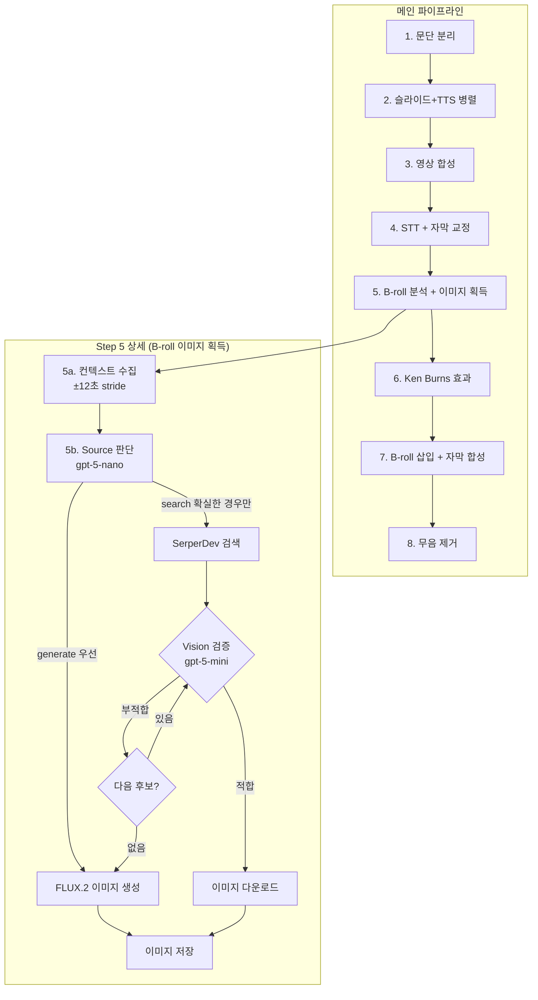
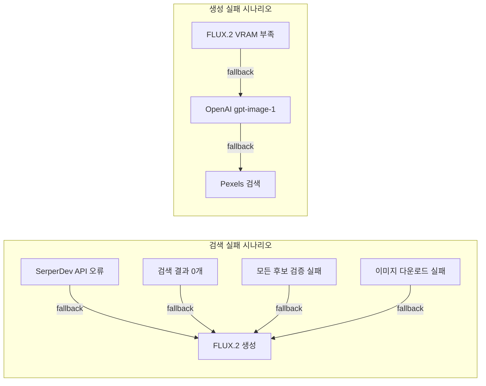
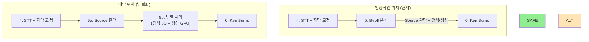

# B-roll 이미지 파이프라인 설계

## 현재 구조 (전체 파이프라인 내)



## Source 판단 정책

### 기본 원칙: **생성 우선, 확실한 경우만 검색**

| Source | 사용 조건 | 예시 |
|--------|----------|------|
| **generate** (기본) | 대부분의 경우 | 추상 개념, 캐릭터, 비유, 일반적 장면 |
| **search** (제한적) | 100% 확실한 실제 대상만 | 특정 제품명(Apple Vision Pro), 유명 랜드마크(에펠탑) |

### search 사용 기준 (엄격)

```
✅ search 허용:
- 정확한 브랜드/제품명: "Tesla Cybertruck", "iPhone 16 Pro"
- 유명 랜드마크: "Eiffel Tower", "Statue of Liberty"
- 공식 로고/UI 스크린샷이 필요한 경우

❌ search 금지 (generate 사용):
- 일반적 개념: "자동차", "스마트폰", "도시"
- 추상적 표현: "성장", "혁신", "미래"
- 비유/메타포: "언어를 배우는 것처럼"
- 애매한 경우: 확신이 없으면 generate
```

## 안정성 고려사항

### 1. 실패 지점과 Fallback 전략



### 2. API 비용 최적화

| 단계 | 모델 | 비용 | 호출 횟수 |
|------|------|------|----------|
| Source 판단 | gpt-5-nano | 최저 | B-roll 개수 × 1 |
| Vision 검증 | gpt-5-mini | 중 | search 항목 × 1~5 |
| 프롬프트 강화 | gpt-5-mini | 중 | generate 항목 × 1 |
| 이미지 생성 | FLUX.2 | 로컬 | generate 항목 × 1 |

**예상 비용 (5개 B-roll, 1 search + 4 generate):**
- Source 판단: ~$0.001
- Vision 검증: ~$0.002 (1 search × 2 후보 평균)
- 프롬프트 강화: ~$0.003
- **총 API 비용: ~$0.006/영상**

## 권장 파이프라인 위치



### 현재 위치가 안정적인 이유

1. **순차 처리**: 자막 교정 완료 후 컨텍스트가 확정됨
2. **Fallback 체인**: search 실패 → generate 자연스럽게 전환
3. **리소스 분리**: 검색(I/O) vs 생성(GPU) 충돌 없음
4. **디버깅 용이**: 각 단계가 명확히 분리됨

### 향후 병렬화 옵션

```python
# 병렬 처리 (선택적)
with ThreadPoolExecutor(max_workers=2) as executor:
    # search 항목: I/O bound (네트워크)
    search_futures = [
        executor.submit(search_and_validate, item)
        for item in plan.broll_items if item.source == "search"
    ]

    # generate 항목: GPU bound (FLUX.2)
    generate_futures = [
        executor.submit(generate_with_flux2, item)
        for item in plan.broll_items if item.source == "generate"
    ]
```

## 설정 예시

```yaml
broll:
  interval_seconds: 12           # B-roll 삽입 간격 (12초마다)
  context_stride_seconds: 12     # 컨텍스트 수집 범위 (±12초)
  force_backend: "flux2_klein"

  image_search:
    enabled: true
    source_decision_model: "gpt-5-nano"   # source 판단 (저렴)
    validation_model: "gpt-5-mini"        # Vision 검증
    validation_enabled: true
    max_candidates: 5
    validation_threshold: 0.7             # 검증 임계값 (높을수록 엄격)
```

## 테스트 결과 요약

| 테스트 | 결과 | 비고 |
|--------|------|------|
| Source 판단 | ✅ 성공 | gpt-5-nano로 generate/search 분류 |
| SerperDev 검색 | ✅ 성공 | Apple Vision Pro, Tesla Cybertruck 등 |
| Vision 검증 | ✅ 성공 | gpt-5-mini로 신뢰도 0.95 판단 |
| Fallback | ✅ 동작 | 검색 실패 시 자동으로 생성 전환 |

## 예상 B-roll 분포

12초 간격 기준, 60초 영상:

| 시점 | 예상 Source | 근거 |
|------|------------|------|
| 12초 | generate | 일반적인 설명 구간 |
| 24초 | generate | 비유/메타포 구간 |
| 36초 | search | 특정 제품명 언급 시 |
| 48초 | generate | 추상적 개념 구간 |

**예상 비율: generate 70~80%, search 20~30%**
