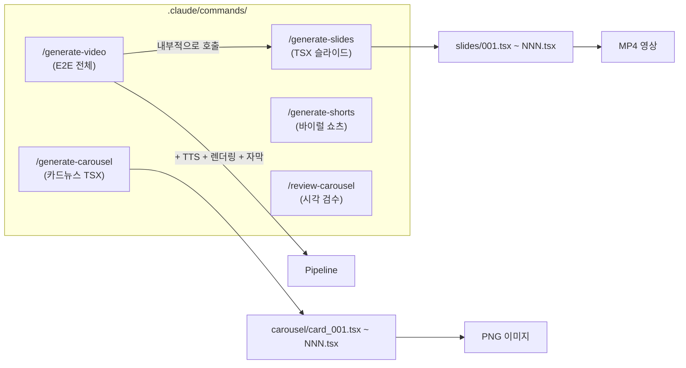
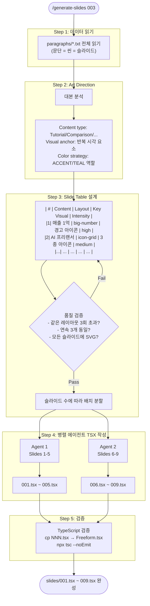
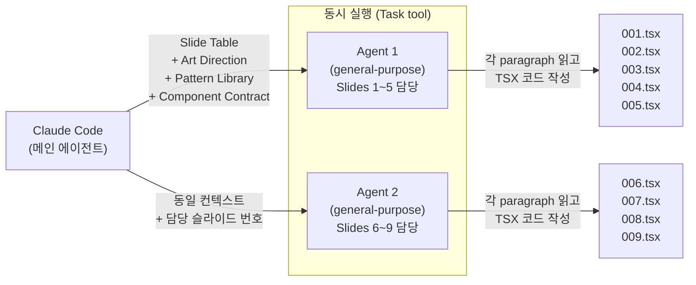
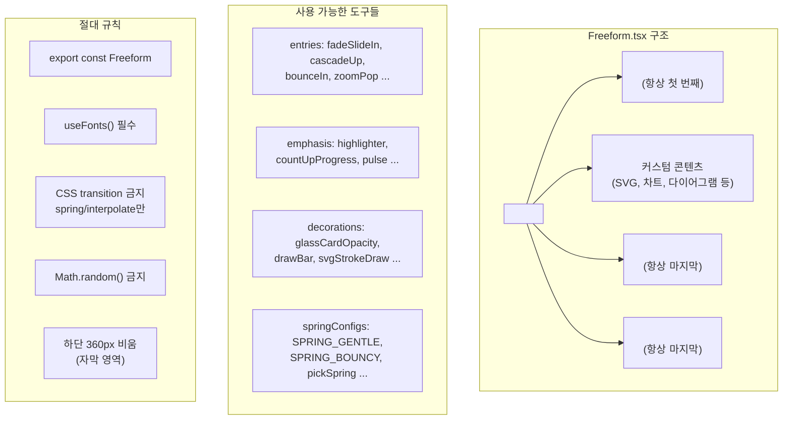
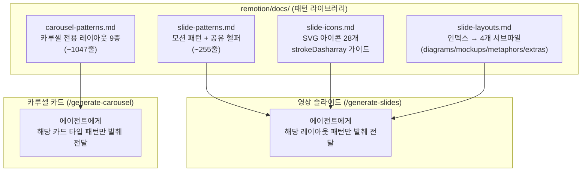
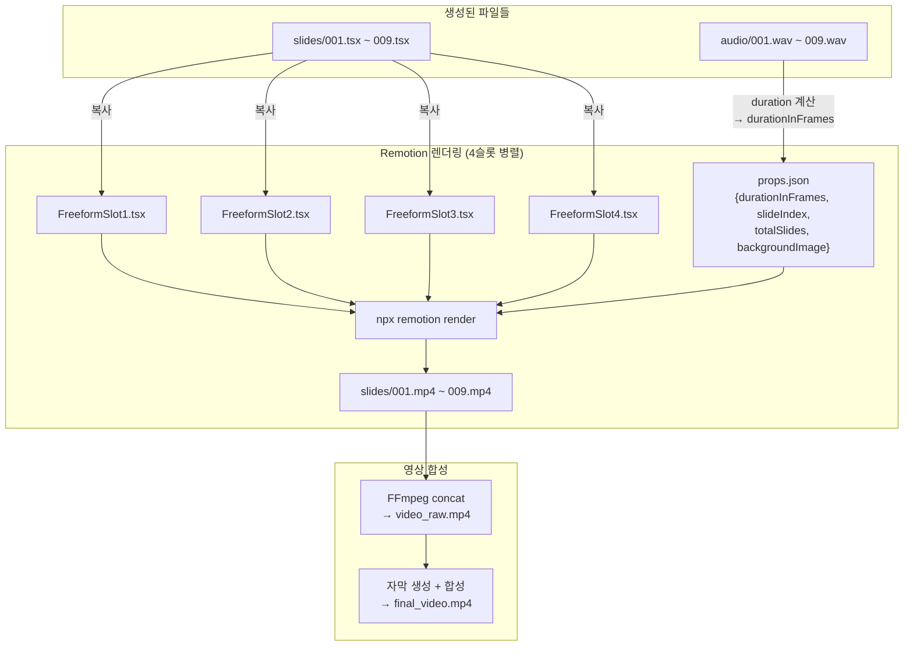
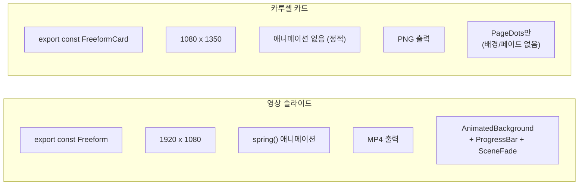
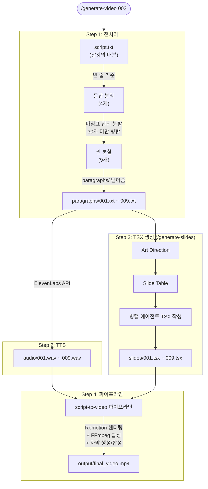
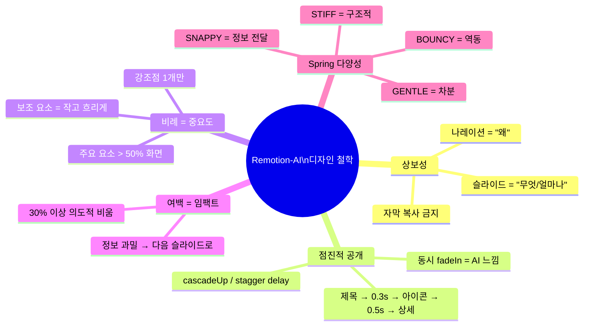

# Remotion Skills 아키텍처 가이드

> Claude Code의 `/slash-commands`(Skills)가 어떻게 TSX 슬라이드와 카루셀 카드를 생성하는지 설명합니다.

---

## 1. 전체 구조: 두 가지 모드

```mermaid
flowchart TB
    subgraph Traditional["기존 방식: Template 모드"]
        A1[script.txt] --> B1["GPT-5-mini API"]
        B1 --> C1["JSON props\n(template + data)"]
        C1 --> D1["11개 고정 템플릿\n(BulletList, BigNumber...)"]
        D1 --> E1[MP4 슬라이드]
    end

    subgraph Modern["현재 방식: Remotion-AI 모드 (Skills)"]
        A2[script.txt] --> B2["Claude Code\n(/generate-slides)"]
        B2 --> C2["커스텀 TSX 코드\n(SVG, 차트, 다이어그램)"]
        C2 --> D2["Freeform 컴포넌트\n(제약 없는 자유 레이아웃)"]
        D2 --> E2[MP4 슬라이드]
    end

    style Traditional fill:#1a1a2e,stroke:#555,color:#999
    style Modern fill:#0d1b2a,stroke:#7C7FD9,color:#fff
```

**핵심 차이**: Template 모드는 AI가 "어떤 템플릿을 쓸지" JSON으로 결정하고, Remotion-AI 모드는 Claude Code가 **TSX 코드 자체를 작성**합니다.

---

## 2. Skills(슬래시 커맨드) 목록

| Skill | 입력 | 출력 | 용도 |
|-------|------|------|------|
| `/generate-video` | script.txt | final_video.mp4 | E2E 영상 (TSX + TTS + 렌더링 + 자막) |
| `/generate-slides` | paragraphs/*.txt | slides/*.tsx | 영상용 TSX 슬라이드 |
| `/generate-carousel` | script.txt | carousel/card_*.tsx | 인스타 카드뉴스용 TSX |
| `/generate-shorts` | 영상 파일 | 쇼츠 클립 | 바이럴 구간 추출 |

---

## 3. `/generate-slides` 상세 흐름

가장 핵심인 TSX 슬라이드 생성 과정입니다.

---

## 4. 병렬 에이전트 디스패치

Claude Code가 여러 에이전트를 동시에 실행하여 TSX를 병렬 작성합니다.

**배치 사이징 규칙:**

| 슬라이드 수 | 배치 수 | 이유 |
|------------|--------|------|
| 1~6 | 1 (순차) | 에이전트 오버헤드 > 이득 |
| 7~12 | 2 | 2개 에이전트 병렬 |
| 13~18 | 3 | 3개 에이전트 병렬 |
| 19+ | 4 | 최대 4개 병렬 |

**각 에이전트에게 전달되는 정보:**
1. 전체 Slide Table (자기 담당 표시)
2. Art Direction 요약
3. 디자인 철학 핵심 원칙
4. 해당 레이아웃의 패턴 코드 (`slide-patterns.md`에서 발췌)
5. TSX Component Contract (필수 구조)
6. 출력 경로

---

## 5. TSX Component Contract

모든 TSX 슬라이드가 반드시 따라야 하는 구조입니다.

---

## 6. 패턴 라이브러리 체계

에이전트들이 참고하는 디자인 레퍼런스입니다.

---

## 7. TSX → 최종 영상 렌더링

TSX 파일이 생성된 후, MP4로 변환되는 과정입니다.

**4슬롯 병렬 렌더링**: 각 슬롯(`FreeformSlot1~4.tsx`)은 독립된 Remotion Composition ID를 가져서 동시에 4개 슬라이드를 렌더링할 수 있습니다.

---

## 8. 슬라이드 vs 카루셀 비교

| | 영상 슬라이드 | 카루셀 카드 |
|---|---|---|
| **Skill** | `/generate-slides` | `/generate-carousel` |
| **Export** | `Freeform` | `FreeformCard` |
| **해상도** | 1920x1080 (16:9) | 1080x1350 (4:5) |
| **애니메이션** | spring(), interpolate() | 없음 (정적 이미지) |
| **출력** | .mp4 | .png |
| **렌더러** | `npx remotion render` | `npx remotion still` |
| **필수 래퍼** | AnimatedBackground + ProgressBar + SceneFade | PageDots만 |

---

## 9. E2E 흐름 (`/generate-video`)

전체 영상 생성을 하나의 커맨드로 실행합니다.

**Step 3이 핵심** — Claude Code가 직접 TSX 코드를 작성하므로 SVG 다이어그램, 커스텀 차트, UI 목업 등 **제약 없는 시각 표현**이 가능합니다. 기존 Template 모드의 11개 고정 레이아웃 제한을 완전히 벗어납니다.

---

## 10. 디자인 철학 요약

