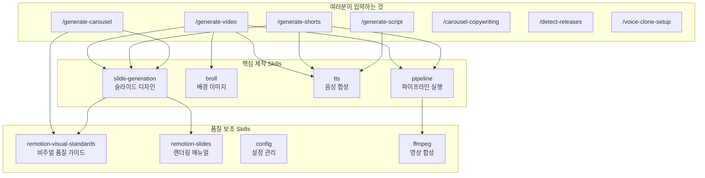
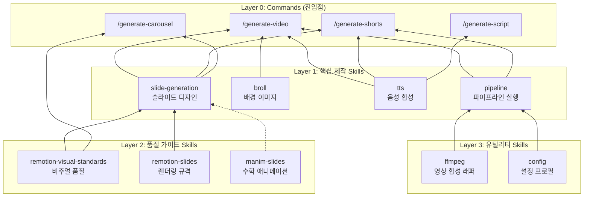
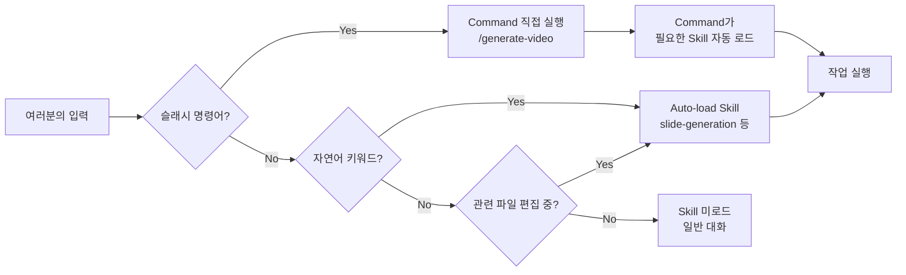

# Skills 완전 해부 -- 이 시스템은 어떻게 돌아가는가

> "한 줄 명령어 뒤에서 15개의 스킬이 톱니바퀴처럼 맞물려 돌아갑니다"

---

## 왜 Skills가 중요한가

이 시스템의 핵심은 **코드가 아니라 Skills**입니다.

파이프라인 코드(Python)는 "TTS 생성 → 슬라이드 렌더링 → 영상 합성"이라는 기계적 흐름을 실행할 뿐입니다. 진짜 창작 판단 -- 어떤 레이아웃을 쓸지, 색상을 어떻게 조합할지, 대본을 어떤 톤으로 쓸지 -- 은 **전부 Skills가 담당**합니다.

```
┌──────────────────────────────────────────────────────────┐
│  여러분이 보는 것:  /generate-video my-project           │
│                         ↓                                │
│  시스템 내부:  15개 Skill이 순서대로 판단하고 실행        │
│                         ↓                                │
│  최종 결과:    완성된 영상 파일                            │
└──────────────────────────────────────────────────────────┘
```

**Skills를 바꾸면 결과물이 바뀝니다.** 코드를 한 줄도 안 고쳐도, Skill 문서만 수정하면 슬라이드 스타일이 바뀌고, 대본 톤이 바뀌고, 브랜딩이 바뀝니다. 이것이 Skills가 이 시스템의 진짜 자산인 이유입니다.

---

## 전체 구조 한눈에 보기

### Skill의 두 종류

```
Skills
├── Commands (슬래시 명령어) ← 여러분이 직접 호출
│   ├── /generate-video        영상 생성
│   ├── /generate-shorts       쇼츠 생성
│   ├── /generate-carousel     카드뉴스 생성
│   ├── /generate-script       대본 생성
│   ├── /carousel-copywriting  캐러셀 카피라이팅
│   ├── /detect-releases       릴리즈 감지
│   └── /voice-clone-setup     보이스 프로필 설정
│
└── Auto-load Skills (자동 스킬) ← Claude가 상황에 맞게 자동 로드
    ├── [핵심] slide-generation, broll, tts, pipeline
    ├── [참조] config, remotion-slides, remotion-visual-standards, ffmpeg
    ├── [특수] avatar, manim-slides, manimce-best-practices
    └── [개발] commit, verify, spec-writer, testing, autoresearch
```

**비유로 이해하기:**
- **Commands** = 식당 메뉴판의 "세트 메뉴" (짜장면 세트, 탕수육 세트)
- **Auto-load Skills** = 주방의 "조리 매뉴얼" (육수 내리기, 면 삶기, 소스 만들기)
- 세트 메뉴를 주문하면 → 주방에서 필요한 매뉴얼들이 자동으로 펼쳐짐

---

## 계층 구조: Command가 Skill을 부르는 흐름



---

## 콘텐츠별 제작 흐름: 어떤 Skill이 언제 동작하는가

### 1. 영상 만들기 (`/generate-video`)

> "대본 하나로 완성 영상이 나오기까지"

```
script.txt (대본)
    │
    ▼
┌─────────────────────────────────────────────────────────────┐
│ Step 1: 대본 분석 + 씬 분할                                  │
│  └─ 문단별로 나누고, 각 문단의 성격을 파악                     │
│     (도입/설명/비교/결론 등)                                   │
└────────────────────────┬────────────────────────────────────┘
                         ▼
┌─────────────────────────────────────────────────────────────┐
│ Step 2: TTS 발음 사전 보강                    [tts skill]    │
│  └─ 대본에서 영어 용어 스캔 → 한글 발음으로 자동 등록          │
│     예: "Claude Code" → "클로드 코드"                         │
│     파일: config/tts_dictionary.yaml                         │
└────────────────────────┬────────────────────────────────────┘
                         ▼
┌─────────────────────────────────────────────────────────────┐
│ Step 3: 슬라이드 디자인 (TSX 코드)    [slide-generation skill]│
│  ├─ Art Direction 결정 (색상 팔레트, 분위기, 키워드)           │
│  ├─ 각 문단에 맞는 레이아웃 선택 (23종 중 택1)                │
│  ├─ TSX 파일 작성 (React 코드 = 슬라이드 1장)                │
│  └─ 검증 (TypeScript 컴파일 + 비주얼 품질 체크)               │
│                                                              │
│  보조 Skill: remotion-visual-standards (WCAG 대비, 타이포)    │
│  보조 Skill: remotion-slides (Freeform 작성법, props 규격)    │
└────────────────────────┬────────────────────────────────────┘
                         ▼
┌─────────────────────────────────────────────────────────────┐
│ Step 4: B-roll 이미지 생성                    [broll skill]  │
│  ├─ 각 문단에 대한 이미지 프롬프트 작성                       │
│  ├─ "생성 vs 검색" 판단 (AI 생성 or 웹 검색)                 │
│  └─ 이미지 백엔드 호출                                       │
│     API 모드: NanoBanana (FLUX) 또는 SerperDev (웹 검색)     │
└────────────────────────┬────────────────────────────────────┘
                         ▼
┌─────────────────────────────────────────────────────────────┐
│ Step 5: 파이프라인 실행                    [pipeline skill]   │
│  ├─ TTS 음성 생성 (ElevenLabs API)                           │
│  ├─ 슬라이드 렌더링 (Remotion → MP4)                         │
│  ├─ B-roll 합성 (배경 이미지 + 슬라이드 오버레이)             │
│  ├─ 자막 합성 (Whisper STT → SRT → 영상에 burn)             │
│  └─ 최종 영상 출력                                           │
│                                                              │
│  보조 Skill: ffmpeg (영상 합치기, 자르기, 오버레이)           │
│  보조 Skill: config (프로필 설정, 백엔드 선택)                │
└────────────────────────┬────────────────────────────────────┘
                         ▼
                 final_video.mp4 (완성!)
```

### 2. 쇼츠 만들기 (`/generate-shorts`)

> "같은 대본을 세로 화면(9:16)에 맞게 재구성"

```
script.txt (대본)
    │
    ▼
┌─────────────────────────────────────────────────────────────┐
│ Step 1: 경로 자동 감지                                       │
│  ├─ cc-XXX 프로젝트? → CC 교육 쇼츠 경로 (C)                 │
│  ├─ --from-video 옵션? → 외부 영상 쇼츠 경로 (A)             │
│  └─ 그 외? → 일반 대본 쇼츠 경로 (B)                         │
└────────────────────────┬────────────────────────────────────┘
                         ▼
┌─────────────────────────────────────────────────────────────┐
│ Step 2: TTS 발음 사전 보강                    [tts skill]    │
│  └─ (영상과 동일)                                            │
└────────────────────────┬────────────────────────────────────┘
                         ▼
┌─────────────────────────────────────────────────────────────┐
│ Step 3: 파이프라인 1차 실행                [pipeline skill]   │
│  └─ TTS 음성 생성 + 씬 분할 (여기까지만 먼저 실행)           │
└────────────────────────┬────────────────────────────────────┘
                         ▼
┌─────────────────────────────────────────────────────────────┐
│ Step 4: 쇼츠 슬라이드 디자인          [slide-generation skill]│
│  ├─ 9:16 세로 화면에 맞는 레이아웃 선택                       │
│  ├─ 훅 타이틀 생성 (처음 1초에 시선 잡기)                     │
│  ├─ Safe Zone 준수 (YouTube 쇼츠 UI 가림 영역 피하기)        │
│  └─ 보조: remotion-visual-standards (세로 화면 전용 가이드)   │
└────────────────────────┬────────────────────────────────────┘
                         ▼
┌─────────────────────────────────────────────────────────────┐
│ Step 5: 파이프라인 2차 실행                [pipeline skill]   │
│  └─ 슬라이드 렌더링 → 자막 합성 → 최종 쇼츠 출력             │
└────────────────────────┬────────────────────────────────────┘
                         ▼
                 쇼츠 영상 (9:16, 60초 이내)
```

**쇼츠가 2단계로 나뉘는 이유:** TTS를 먼저 만들어야 각 슬라이드의 정확한 길이(초)를 알 수 있기 때문입니다. 슬라이드는 음성 길이에 맞춰 설계됩니다.

### 3. 캐러셀(카드뉴스) 만들기

> "2단계 프로세스: 카피 → 디자인"

```
주제/소재
    │
    ▼
┌───────────────────────── 1단계 ─────────────────────────────┐
│ /carousel-copywriting                                        │
│  ├─ 타겟 오디언스 분석                                       │
│  ├─ 커버 카피 후보 3개 생성 (훅 엔지니어링)                   │
│  ├─ 8~12장 카드별 텍스트 작성                                │
│  ├─ 8가지 메트릭으로 자가 평가 (40점 만점)                   │
│  └─ B등급 이하면 자동 개선 (최대 3회)                        │
│                                                              │
│  출력: copy_deck.md (카드별 텍스트 완성본)                   │
└────────────────────────┬────────────────────────────────────┘
                         ▼
┌───────────────────────── 2단계 ─────────────────────────────┐
│ /generate-carousel                                           │
│  ├─ copy_deck.md 읽기                                        │
│  ├─ Art Direction 결정 (색상, 무드, 레이아웃 전략)            │
│  ├─ 카드별 TSX 디자인                    [slide-generation]   │
│  ├─ PNG 렌더링                                               │
│  └─ 시각 리뷰 + 품질 게이트                                  │
│                                                              │
│  보조: remotion-visual-standards (WCAG 대비, 타이포그래피)    │
│  출력: card_001.png ~ card_012.png                           │
└─────────────────────────────────────────────────────────────┘
```

### 4. 대본 만들기 (`/generate-script`)

> "소재 → 영상 대본, 한 번에"

```
소재 (기술 문서, 뉴스 기사, 아이디어 등)
    │
    ▼
┌─────────────────────────────────────────────────────────────┐
│ Step 1: 포맷 자동 감지                                       │
│  ├─ 긴 문서/기술 자료? → Longform (풀 영상 대본)              │
│  ├─ 짧은 주제/단일 포인트? → Shorts (60초 대본)              │
│  └─ cc-XXX 카드 ID? → CC 교육 대본                           │
└────────────────────────┬────────────────────────────────────┘
                         ▼
┌─────────────────────────────────────────────────────────────┐
│ Step 2: 대본 작성                                            │
│  ├─ 핵심 메시지 추출                                         │
│  ├─ 구어체 변환 (자연스러운 말투)                             │
│  ├─ 훅(도입부) 설계 -- 첫 3초에 시선 잡기                    │
│  └─ 사용자 검토 + 수정                                       │
└────────────────────────┬────────────────────────────────────┘
                         ▼
┌─────────────────────────────────────────────────────────────┐
│ Step 3: 발음 사전 보강                         [tts skill]   │
│  └─ 대본의 영어 용어 → 한글 발음으로 사전에 등록              │
└────────────────────────┬────────────────────────────────────┘
                         ▼
                 script.txt (완성된 대본)
```

---

## Skill 계층 다이어그램 (의존 관계)



> **화살표 방향**: "A → B" = "A가 B에 의해 사용됨"
> 아래에서 위로 올라가는 구조입니다. Layer 3이 가장 기초, Layer 0이 최종 진입점.

---

## API 모드에서 사용되는 모든 Skills 상세

> API 모드(`CONFIG_PROFILE=api`)에서는 GPU 없이 클라우드 API만으로 동작합니다.
> 아래는 API 모드에서 활성화되는 모든 Skill을 역할별로 정리한 것입니다.

### 핵심 제작 Skills (4개)

#### `slide-generation` -- 슬라이드 디자인의 두뇌

| 항목 | 내용 |
|------|------|
| **무엇을 하는가** | 대본의 각 문단을 **시각적 슬라이드(TSX 코드)**로 변환합니다 |
| **왜 중요한가** | 영상의 시각적 품질을 결정하는 가장 중요한 Skill |
| **언제 발동하는가** | `/generate-video`, `/generate-shorts`, `/generate-carousel` 실행 시 자동 |
| **자연어 트리거** | "슬라이드만 다시 만들어줘", "TSX 수정해줘", "레이아웃 바꿔줘" |
| **파일 위치** | `.claude/skills/slide-generation/` (8개 챕터) |

**챕터 구성:**

```
slide-generation/
├── SKILL.md                      ← 목차 (인덱스)
├── chapter-longform-tsx.md       ← 16:9 영상 슬라이드 규칙
├── chapter-shorts-tsx.md         ← 9:16 쇼츠 슬라이드 규칙
├── chapter-cc-shorts.md          ← CC 교육 쇼츠 전용 규칙
├── chapter-art-direction.md      ← 아트 디렉션 (색상, 분위기)
├── chapter-hook-titles.md        ← 훅 타이틀 생성 규칙
├── chapter-batch-dispatch.md     ← 병렬 생성 전략
├── chapter-animation-memory.md   ← 애니메이션 패턴 기억
└── chapter-tsx-checklist.md      ← 최종 검증 체크리스트
```

**동작 원리:**
1. 대본의 각 문단 성격을 분석합니다 (도입? 비교? 결론?)
2. 23종의 레이아웃 패턴 중 가장 적합한 것을 선택합니다
3. Art Direction(색상, 분위기)에 맞춰 TSX(React) 코드를 생성합니다
4. 검증 체크리스트로 품질을 확인합니다

---

#### `broll` -- 배경 이미지 매니저

| 항목 | 내용 |
|------|------|
| **무엇을 하는가** | 각 슬라이드의 **배경 이미지**를 생성하거나 검색합니다 |
| **왜 중요한가** | 배경 이미지가 영상의 시각적 풍부함을 결정 |
| **언제 발동하는가** | `/generate-video` 실행 시 자동 (쇼츠에서는 선택적) |
| **자연어 트리거** | "B-roll 수정해줘", "배경 이미지 바꿔줘", "이미지 프롬프트 수정" |
| **파일 위치** | `.claude/skills/broll/` (3개 챕터) |

**챕터 구성:**

```
broll/
├── SKILL.md                      ← 목차
├── chapter-architecture.md       ← B-roll 시스템 구조
├── chapter-backends.md           ← 4가지 이미지 백엔드
└── chapter-prompt-workflow.md    ← 프롬프트 생성 워크플로
```

**API 모드의 이미지 백엔드:**

| 백엔드 | 방식 | 용도 |
|--------|------|------|
| NanoBanana | AI 이미지 생성 (FLUX) | 창작 이미지가 필요할 때 |
| SerperDev | 웹 이미지 검색 | 실제 사진/스크린샷이 필요할 때 |

> GPU 전용 백엔드(FLUX.2 Klein, Flux Kontext)는 API 모드에서 비활성화됩니다.

**동작 원리:**
1. 각 문단의 내용을 분석합니다
2. "이 장면에는 AI 생성이 적합한가, 실제 사진 검색이 적합한가?" 판단
3. 이미지 생성 프롬프트를 작성합니다 (영어, 구체적 묘사)
4. 선택된 백엔드로 이미지를 생성/검색합니다

---

#### `tts` -- 음성 합성 + 발음 관리

| 항목 | 내용 |
|------|------|
| **무엇을 하는가** | 대본을 **음성 파일(WAV)**로 변환하고, 발음 사전을 관리합니다 |
| **왜 중요한가** | 영상의 나레이션 품질 + 영어 용어의 자연스러운 한국어 발음 |
| **언제 발동하는가** | `/generate-video`, `/generate-shorts`, `/generate-script` 실행 시 자동 |
| **자연어 트리거** | "발음 사전 보강해줘", "TTS 바꿔줘", "음성 백엔드 변경" |
| **파일 위치** | `.claude/skills/tts/` (2개 챕터) |

**챕터 구성:**

```
tts/
├── SKILL.md                              ← 목차
├── chapter-backends-and-selection.md      ← 4가지 TTS 백엔드 + 자동 선택
└── chapter-dictionary-enhancement.md     ← 발음 사전 보강 워크플로
```

**API 모드의 TTS 백엔드:**

| 백엔드 | 설명 |
|--------|------|
| ElevenLabs | 클라우드 TTS API (API 모드 기본) |

> GPU 전용 백엔드(Qwen CUDA/MPS, Custom Voice)는 API 모드에서 비활성화됩니다.

**발음 사전이란?**
```yaml
# config/tts_dictionary.yaml
"Claude Code": "클로드 코드"
"MCP": "엠씨피"
"Anthropic": "앤쓰로픽"
```
TTS가 영어 용어를 읽을 때 한국어 발음으로 대체합니다. 이 사전은 대본 생성 시 자동으로 보강됩니다.

---

#### `pipeline` -- 파이프라인 실행 매뉴얼

| 항목 | 내용 |
|------|------|
| **무엇을 하는가** | 4가지 파이프라인의 **실행 순서와 옵션**을 정의합니다 |
| **왜 중요한가** | 모든 생성 과정의 뼈대 -- 무엇을 어떤 순서로 실행할지 |
| **언제 발동하는가** | `/generate-video`, `/generate-shorts` 실행 시 자동 |
| **자연어 트리거** | "파이프라인 흐름 알려줘", "script-to-video 설명해줘" |
| **파일 위치** | `.claude/skills/pipeline/` (4개 챕터) |

**4가지 파이프라인:**

| 파이프라인 | 입력 | 출력 | API 모드 |
|-----------|------|------|:--------:|
| script-to-video | script.txt | 16:9 영상 | ✅ |
| script-to-shorts | script.txt | 9:16 쇼츠 | ✅ |
| video-to-shorts | 영상 파일 | 9:16 쇼츠 | ✅ |
| script-to-carousel | script.txt | 4:5 카드뉴스 | ✅ |

**7단계 공통 흐름:**
```
① 대본 파싱 → ② TTS 생성 → ③ 씬 분할 → ④ 슬라이드 렌더링
→ ⑤ B-roll 합성 → ⑥ 자막 합성 → ⑦ 최종 출력
```

---

### 품질 보조 Skills (4개)

#### `remotion-visual-standards` -- 비주얼 품질 기준

| 항목 | 내용 |
|------|------|
| **무엇을 하는가** | 슬라이드의 **시각 품질 기준**을 정의합니다 |
| **왜 중요한가** | 못생긴 슬라이드를 방지하는 품질 가드레일 |
| **언제 발동하는가** | `slide-generation`이 로드될 때 함께 자동 로드 |
| **자연어 트리거** | "슬라이드 품질 체크해줘", "비주얼 가이드 보여줘" |

**정의하는 기준들:**
- 배경 처리 (블러, 그라디언트, 오버레이)
- 텍스트 대비 (WCAG 기준 충족)
- 레이아웃 다양성 (연속 동일 레이아웃 금지)
- 카드 스타일링 (radius, shadow, padding)
- 한국어 타이포그래피 (폰트, 크기, 자간)
- 쇼츠 Safe Zone (YouTube UI에 가리지 않는 영역)

---

#### `remotion-slides` -- 렌더링 기술 규격

| 항목 | 내용 |
|------|------|
| **무엇을 하는가** | Remotion 프레임워크의 **TSX 작성법과 렌더링 규격**을 정의 |
| **왜 중요한가** | 슬라이드가 제대로 렌더링되려면 규격에 맞아야 함 |
| **언제 발동하는가** | TSX 파일 작성/수정 시 자동 |
| **자연어 트리거** | "슬라이드 수정해줘", "TSX 작성법 알려줘", "렌더링 문제 해결" |

**핵심 내용:**
- Freeform 모드: 자유롭게 TSX 코드를 작성
- 자동 주입 Props: `width`, `height`, `fps`, `durationInFrames` 등
- 병렬 렌더링: 여러 슬라이드를 동시에 렌더링하는 전략

---

#### `config` -- 설정 프로필 관리

| 항목 | 내용 |
|------|------|
| **무엇을 하는가** | 설정 프로필(base/api/asmr)과 환경변수 **우선순위**를 관리 |
| **왜 중요한가** | API 모드 전환, 백엔드 선택, 파이프라인 옵션 조정 |
| **언제 발동하는가** | 설정 변경 요청 시 자동 |
| **자연어 트리거** | "설정 변경하고 싶어", "프로필 전환해줘", "config 수정" |

**프로필 시스템:**
```
config/
├── config.base.yaml    ← 기본값 (GPU 모드)
├── config.api.yaml     ← API 전용 오버라이드
└── config.asmr.yaml    ← ASMR 채널 전용
```

워크숍에서는 `CONFIG_PROFILE=api` 를 사용합니다.

---

#### `ffmpeg` -- 영상 합성 도구

| 항목 | 내용 |
|------|------|
| **무엇을 하는가** | FFmpeg 래퍼 함수들의 **사용법과 주의사항**을 정의 |
| **왜 중요한가** | 영상 합치기, 자르기, 오버레이 등 모든 후처리 |
| **언제 발동하는가** | 파이프라인 실행 중 영상 합성 단계에서 자동 |
| **자연어 트리거** | "영상 합쳐줘", "FFmpeg 문제 해결", "영상 자르기" |

---

### 콘텐츠 소싱 Skills (1개)

#### `detect-releases` (Command) -- 릴리즈 감지기

| 항목 | 내용 |
|------|------|
| **무엇을 하는가** | Claude Code GitHub 릴리즈를 **자동 감지하고 콘텐츠 후보를 선별** |
| **왜 중요한가** | 소재를 자동으로 찾아주는 콘텐츠 소싱 자동화 |
| **언제 발동하는가** | `/detect-releases` 직접 실행 |
| **후속 흐름** | 선별된 카드 → `/generate-script` → `/generate-shorts` |

**동작 원리:**
1. GitHub API로 최신 릴리즈 목록을 가져옵니다
2. 각 항목을 4가지 기준(시각 임팩트, 일상 관련성, 비개발자 이해도, 교육 가치)으로 채점합니다
3. 기존 콘텐츠와 중복 체크합니다
4. 통과한 항목을 "Auto-Update 카드"(`cc-au-NNN`)로 생성합니다
5. 이 카드가 나중에 `/generate-script --card-id cc-au-NNN`의 입력이 됩니다

---

### 보이스 Skills (1개)

#### `voice-clone-setup` (Command) -- 보이스 프로필 설정

| 항목 | 내용 |
|------|------|
| **무엇을 하는가** | YouTube 영상이나 녹음에서 **특정 화자의 음성 프로필을 추출** |
| **왜 중요한가** | 나만의 목소리로 TTS를 사용하려면 프로필이 필요 |
| **언제 발동하는가** | `/voice-clone-setup` 직접 실행 |
| **API 모드 참고** | 프로필 생성은 가능하지만, 사용은 Custom Voice 백엔드(GPU) 필요 |

**5단계 프로세스:**
```
음원(YouTube URL/파일) → 화자 분리 → 타겟 화자 추출
→ 음성 특성 임베딩 → 테스트 생성 → 스피커 프로필 저장
```

---

### 개발/유지보수 Skills (5개)

이 Skills는 콘텐츠 제작이 아닌 **시스템 유지보수**에 사용됩니다.

| Skill | 역할 | 발동 조건 |
|-------|------|----------|
| `commit` | 코드 변경사항을 Git에 저장 | `/commit` 직접 실행 |
| `verify` | 구현 완료 후 코드 품질 검증 | `/verify` 직접 실행 |
| `spec-writer` | 새 기능 구현 전 설계 명세 작성 | "기능 구현해줘", "SPEC 작성" |
| `testing` | 테스트 작성 및 품질 도구 매뉴얼 | 테스트 관련 작업 시 자동 |
| `autoresearch` | Skill 자체를 자동으로 최적화 | "스킬 개선해줘", "eval 돌려줘" |

> 워크숍에서 직접 사용할 일은 적지만, `/skill-creator`로 나만의 스킬을 만든 후 `autoresearch`로 자동 개선할 수 있습니다.

---

## Skill이 실제로 동작하는 원리

### 1단계: 트리거 (어떻게 Skill이 로드되는가)



**세 가지 트리거 방식:**
1. **직접 호출**: `/generate-video my-project` → 해당 Command 실행
2. **자연어 감지**: "슬라이드 수정해줘" → `slide-generation` 자동 로드
3. **파일 컨텍스트**: `slides/slide_001.tsx` 편집 중 → `remotion-slides` 자동 로드

### 2단계: 챕터 선택 (SKILL.md → 필요한 챕터만)

Skill은 "목차(SKILL.md) + 본문(chapter-*.md)"로 구성됩니다. Claude는 상황에 맞는 챕터만 선택적으로 읽습니다.

```
예: /generate-video 실행 시

slide-generation/SKILL.md (목차 확인)
    ├─ chapter-art-direction.md     ✅ 로드 (아트 디렉션 필요)
    ├─ chapter-longform-tsx.md      ✅ 로드 (16:9 영상이니까)
    ├─ chapter-shorts-tsx.md        ❌ 스킵 (쇼츠 아님)
    ├─ chapter-cc-shorts.md         ❌ 스킵 (CC 아님)
    ├─ chapter-hook-titles.md       ❌ 스킵 (영상에는 불필요)
    ├─ chapter-batch-dispatch.md    ✅ 로드 (병렬 생성)
    └─ chapter-tsx-checklist.md     ✅ 로드 (검증 필요)
```

> **왜 이렇게 하는가?** Claude Code의 컨텍스트(기억 용량)는 한정적입니다. 모든 챕터를 한꺼번에 읽으면 중요한 내용이 묻힙니다. 필요한 것만 읽어야 품질이 높아집니다.

### 3단계: 실행 (Skill의 지시대로 작업 수행)

Skill 문서에는 **구체적인 규칙과 제약 조건**이 적혀 있습니다:

```
예: chapter-longform-tsx.md의 일부 규칙

- 연속으로 같은 레이아웃 사용 금지
- 텍스트 컬러는 배경과 WCAG AA 이상 대비
- 한 슬라이드에 텍스트 50단어 이하
- spring 애니메이션의 damping은 12~20 사이
```

Claude는 이 규칙을 따라 TSX 코드를 작성합니다. **규칙이 바뀌면 결과물이 바뀝니다.**

---

## 전체 Skill 맵 (한 장 요약)

```
┌─────────────────────────────────────────────────────────────────┐
│                     Content Creation Flow                        │
│                                                                  │
│  소재 발굴          대본 작성          콘텐츠 제작                │
│  ─────────         ─────────         ─────────                   │
│                                                                  │
│  /detect-releases  /generate-script  /generate-video             │
│       │                 │                 │                       │
│       │                 │            ┌────┼────┬────────┐        │
│       ▼                 ▼            ▼    ▼    ▼        ▼        │
│   cc-content/      script.txt    slide  broll  tts   pipeline    │
│   cards.json                     -gen                            │
│       │                 │            │              │             │
│       │                 │            ▼              ▼             │
│       │                 │        remotion-     config             │
│       │                 │        visual-std    ffmpeg             │
│       │                 │                                        │
│       │                 ├────────────────────────────────────┐   │
│       │                 │                                    │   │
│       ▼                 ▼                                    ▼   │
│  /generate-script  /generate-shorts             /generate-carousel│
│  --card-id              │                            │           │
│                    ┌────┼────┐                       │           │
│                    ▼    ▼    ▼                       ▼           │
│                 slide  tts  pipeline            slide-gen        │
│                 -gen                            + visual-std     │
│                                                                  │
│                                                                  │
│  ─── Commands (직접 호출)                                        │
│  ─── Skills (자동 로드)                                          │
│  ─── 데이터 (입출력 파일)                                        │
└─────────────────────────────────────────────────────────────────┘
```

---

## 콘텐츠 유형별 Skill 활성화 매트릭스

어떤 콘텐츠를 만들 때 어떤 Skill이 동작하는지 한눈에:

| Skill | 영상 (16:9) | 쇼츠 (9:16) | 캐러셀 (4:5) | 대본만 |
|-------|:-----------:|:-----------:|:------------:|:------:|
| `slide-generation` | ✅ longform | ✅ shorts/cc | ✅ carousel | - |
| `broll` | ✅ | 선택적 | - | - |
| `tts` | ✅ | ✅ | - | ✅ 사전만 |
| `pipeline` | ✅ | ✅ | - | - |
| `remotion-visual-standards` | ✅ (자동) | ✅ (자동) | ✅ (자동) | - |
| `remotion-slides` | ✅ (자동) | ✅ (자동) | ✅ (자동) | - |
| `config` | ✅ (자동) | ✅ (자동) | ✅ (자동) | - |
| `ffmpeg` | ✅ (자동) | ✅ (자동) | - | - |

---

## 실전 시나리오: "대본 하나로 3종 콘텐츠 만들기"

```
Step 1: 대본 작성
  /generate-script my-project
  → [tts] 발음 사전 자동 보강
  → script.txt 생성

Step 2: 영상 제작
  /generate-video my-project
  → [slide-generation] 16:9 TSX 슬라이드 23장
  → [broll] 배경 이미지 23장
  → [tts] ElevenLabs 나레이션
  → [pipeline] 모든 것을 합쳐서 final_video.mp4

Step 3: 쇼츠 제작 (같은 대본 재활용)
  /generate-shorts my-project
  → [slide-generation] 9:16 TSX 슬라이드 5장 (핵심만 압축)
  → [tts] 같은 나레이션 재활용 가능
  → [pipeline] 쇼츠 영상 출력

Step 4: 캐러셀 제작 (같은 주제 재활용)
  /carousel-copywriting my-project
  → 카드별 텍스트 자동 작성 + 품질 자가평가
  → copy_deck.md 생성

  /generate-carousel my-project
  → [slide-generation] 4:5 카드 TSX 10장
  → [remotion-visual-standards] 품질 가이드 적용
  → card_001.png ~ card_010.png 출력
```

**결과:** 대본 1개 → 영상 + 쇼츠 + 카드뉴스 3종 완성

---

## Skills를 수정하면 어떤 일이 일어나는가

Skills의 진짜 강점은 **수정하면 모든 후속 결과물에 반영**된다는 것입니다.

| 수정 대상 | 수정 예시 | 영향 범위 |
|----------|----------|----------|
| `slide-generation` | "항상 다크 테마 사용" 규칙 추가 | 모든 영상/쇼츠/캐러셀의 슬라이드 |
| `tts` | 발음 사전에 새 단어 추가 | 해당 단어가 나오는 모든 나레이션 |
| `broll` | "검색 우선" → "생성 우선"으로 변경 | 모든 영상의 배경 이미지 |
| `remotion-visual-standards` | 폰트 크기 기준 변경 | 모든 슬라이드의 텍스트 |

> `/skill-creator`를 사용하면 기존 Skill을 안전하게 수정하거나 새로운 Skill을 만들 수 있습니다.

---

## FAQ

### Q: Skill과 Command의 차이가 뭔가요?
**Command**는 `/generate-video`처럼 직접 호출하는 명령어입니다. **Skill**은 Command 내부에서 또는 자연어 대화에서 자동으로 로드되는 지시서입니다. Command가 "주문", Skill이 "레시피"입니다.

### Q: API 모드에서 안 되는 것은?
- **아바타(Ditto)**: GPU 필요 → API 모드에서 비활성화
- **로컬 이미지 생성(FLUX.2 Klein, Flux Kontext)**: GPU 필요 → NanoBanana(클라우드)로 대체
- **로컬 TTS(Qwen)**: GPU 필요 → ElevenLabs(클라우드)로 대체

### Q: 어떤 Skill이 로드됐는지 어떻게 알 수 있나요?
Claude Code가 Skill을 로드하면 대화 중에 해당 Skill의 규칙을 따르기 시작합니다. 명시적으로 "slide-generation 스킬을 로드합니다"라고 알려주는 경우도 있습니다.

### Q: 나만의 Skill을 만들 수 있나요?
네! `/skill-creator`를 사용하면 됩니다. 예를 들어 "내 채널은 항상 파란색 배경 + 흰 텍스트를 써"라는 규칙을 Skill로 만들면, 이후 모든 영상에 자동 적용됩니다. 자세한 내용은 [13-custom-skills.md](13-custom-skills.md)를 참고하세요.

### Q: Skill 파일을 직접 수정해도 되나요?
가능하지만, `/skill-creator`를 사용하는 것을 권장합니다. 직접 수정하면 포맷이 깨지거나 다른 Skill과 충돌할 수 있습니다.
